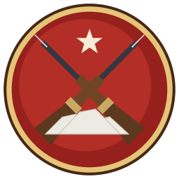

# Guerra del Pacífico: Salitre y Pólvora

Juego de **estrategia en tiempo real** al estilo de *StarCraft* y *WarCraft*,
ambientado en la Guerra del Pacífico (1879-1884). Chile, Perú, Bolivia y, como
escenario hipotético, la Argentina, se disputan el salitre del desierto con
ejércitos de la época: infantería de línea, cantineras, ingenieros dinamiteros,
caballería, artillería Krupp y ametralladoras Gatling, mandados por héroes
históricos como Baquedano, San Martín Penrose, Bolognesi, Grau, Abaroa o Roca.

Es un **programa de escritorio** (no una página web). Tiene dos partes:

- **El servidor** (*backend*) manda la partida: simula el combate, decide qué ve
  cada jugador, guarda las cuentas, el escalafón y las repeticiones en una base de
  datos SQLite. Puede correr dentro del mismo juego, en el computador de un
  compañero o en un servidor dedicado (incluso en Docker).
- **El cliente** (*frontend*) dibuja el campo de batalla con la tarjeta de video
  y envía las órdenes del jugador.

El juego en red con los compañeros es el centro del diseño: ver
[docs/MULTIJUGADOR.md](docs/MULTIJUGADOR.md).



## Instalación

**Windows.** Ejecute `GuerraDelPacifico-<versión>-Instalador.exe`. El instalador
crea los accesos «Guerra del Pacífico» y «Servidor dedicado» en el menú de
inicio y, si se marca la opción, permite el juego en red en el cortafuegos de
Windows. También hay una versión portátil que se descomprime y se usa sin
instalar (`GuerraDelPacifico.exe` dentro de la carpeta). Ambas se generan en
GitHub Actions (pestaña *Actions* → flujo «RTS Salitre y Pólvora» → última
ejecución → artefactos `instalador-windows` y `portatil-windows`; hay que
iniciar sesión en GitHub para descargarlos) o en una versión publicada.

**macOS** (Mac con procesador Intel o Apple Silicon, macOS 10.13 o posterior).
Abra `GuerraDelPacifico-<versión>-macOS.dmg` y arrastre *Guerra del Pacífico*
sobre *Aplicaciones*. La aplicación no está registrada ante Apple, así que la
primera vez macOS no la deja abrir: en macOS 15 o posterior, después del primer
intento vaya a *Ajustes del Sistema → Privacidad y seguridad* y pulse *Abrir
igualmente*; en macOS 14 o anterior, clic derecho sobre la aplicación → *Abrir*.
Si pregunta por la red local, permítala: así encuentra las partidas de los
compañeros. Se genera en GitHub Actions (artefacto `aplicacion-macos`), donde se
prueba en el macOS más reciente, también la parte para Intel.

**Linux.** Descomprima `GuerraDelPacifico-<versión>-linux.tar.gz` y ejecute
`GuerraDelPacifico/GuerraDelPacifico`.

**Copia en el repositorio.** El instalador de Windows y la aplicación para macOS
también pueden guardarse en [`rts/descargas/`](descargas/LEEME.md), desde donde
se bajan con PowerShell o con la Terminal del Mac sin pasar por el navegador.

**Si el navegador o Windows bloquean la descarga.** El juego es nuevo y no
lleva firma digital, así que Chrome, Edge y Windows desconfían de él aunque no
tenga nada malicioso:

- *Chrome*: abra las descargas (`Ctrl + J`) y, en el archivo bloqueado, use el
  menú de tres puntos (⋮) → *Descargar archivo sospechoso* (o *peligroso*) →
  confirme. Si dice «bloqueado por tu organización», ese Chrome lo administra el
  colegio o la empresa y no se puede saltar: use otro equipo o navegador.
- *Edge*: en la descarga, «…» → *Conservar* → *Mostrar más* → *Conservar de todos
  modos*.
- *«Virus detectado»*: lo detuvo Windows Defender (los programas hechos con
  PyInstaller a veces dan falsos positivos). Abra *Seguridad de Windows →
  Protección antivirus y contra amenazas → Historial de protección*, elija el
  elemento y pulse *Acciones → Restaurar* o *Permitir en el dispositivo*.
- Al abrir el instalador, *Windows protegió su PC*: *Más información →
  Ejecutar de todas formas*.

**Desde el código fuente** (cualquier sistema con Python 3.11 o más nuevo):

```sh
cd rts
python -m pip install -r requirements.txt
python -m salitre                 # el juego
python -m salitre --servidor      # el servidor dedicado (no necesita pygame)
```

Los datos de cada jugador (configuración, perfil, repeticiones, capturas y
registros) se guardan en `%APPDATA%\GuerraDelPacifico` en Windows, en
`~/Library/Application Support/GuerraDelPacifico` en macOS y en
`~/.local/share/guerra-del-pacifico` en Linux; no se borran al desinstalar.

## Cómo se juega

### Economía

| Recurso | De dónde sale | Para qué |
|---------|---------------|----------|
| **Salitre** (mineral principal) | Calicheras: los trabajadores extraen 5 por viaje | Se **vende en el Cuartel General** al entregarlo, 1 × 1 por dinero: sobre el techo sale un **$ dorado** |
| **Dinero** | La venta del salitre (se empieza con $ 100) | Formar tropas, construir e investigar: todo cuesta dinero |
| **Agua** (como el gas de *StarCraft*) | Pozos: hay que levantar un **molino de agua** encima; 6 por viaje | Caballería, artillería, héroes, investigaciones |

- **El Cuartel General llega a la campaña**: al empezar el campo está vacío y a
  los diez segundos el cuartel llega **en tren**, por un ramal del ferrocarril
  salitrero (Pampa del Tamarugal, Alto de la Alianza y Cuatro Naciones), o **en
  carreta** por el camino en los mapas campales. Se despliega con los seis
  primeros **trabajadores chinos**, que salen solos a las calicheras; el convoy
  se vuelve por donde vino.
- Los trabajadores recolectan y construyen. Cada **pozo** muestra con una barra
  y una cifra el agua que le queda.
- La **población** limita el ejército: el Cuartel General y cada **Depósito de
  Intendencia** dan 10 (el Fortín argentino, 5), hasta un máximo de **200**.
- Costo en población: trabajador, infante y cantinera **1**; ingeniero **2**;
  caballería **5**; artillería y ametralladoras **10**; héroes 4.

### Árbol de edificios

```
Cuartel General ── Barracas ─┬─ Hospital de campaña (cantineras)
   │                         ├─ Trinchera
   │                         └─ Barracón de Instrucción ── Caballeriza ── Central de Telégrafos ─┬─ Estado Mayor (héroes, espías)
   │                                                                                            └─ Parque de Artillería*
   ├─ Depósito de Intendencia (+10 de población)
   ├─ Molino de agua (sobre un pozo)
   └─ Maestranza (mejoras de armas y equipo) ─┬─ Reducto
                                              ├─ Muelle (transportes, cañoneras, héroes navales)
                                              └─ Parque de Artillería* (requiere también la Central de Telégrafos)
```

Las cifras completas de cada unidad, edificio, investigación y héroe están en
[docs/TABLAS.md](docs/TABLAS.md), generadas desde los datos del juego.

### Ejército

- **Infante de línea** (barracas): la base del ejército.
- **Cantinera** o **rabona** (barracas, requiere hospital): cura a la tropa.
- **Ingeniero dinamitero** (barracas, requiere barracón): lanza dinamita contra
  tropas y fortificaciones.
- **Granadero** y **Cazador a caballo** (caballeriza): carga al sable y
  carabina; el nombre cambia según la nación (Húsar de Junín, Lancero de frontera…).
- **Cañón de montaña**, **cañón de campaña** y **ametralladora Gatling**
  (parque de artillería): las unidades más poderosas y caras. Las piezas se
  **emplazan** para disparar y se enganchan para marchar.
- **Espía** (Estado Mayor): invisible salvo ante detectores; sabotea edificios.
- **Transporte a vapor** y **cañonera** (muelle): para los mapas con islas.
- **Unidades propias** de cada nación: Zapador (Chile), Torpedista y Montonero
  (Perú), Colorados (Bolivia), Baqueano y Fortín (Argentina).
- **Héroes**: cada nación tiene de cuatro a cinco, todos personajes reales. Su
  **aura de mando** mejora el daño, la armadura, la velocidad o la curación de la
  tropa cercana, y cada uno tiene una habilidad (tecla **Q**).
- **Uniformes por arma**: el infante, el zapador (quepí azul, mandil de cuero y
  zapapico), el dinamitero (blusa de brin y canana de cartuchos), el torpedista
  (de marinero), el granadero (morrión y caballo morcillo) y el cazador (dolmán
  con alamares y caballo alazán) se distinguen de un vistazo, con los colores de
  cada nación. Detalle en [docs/DISENO.md](docs/DISENO.md).
- La **cantinera** solo atiende a la tropa propia: aunque se le ordene atacar, no
  va hacia el enemigo.

### Guarniciones

Con la infantería seleccionada, clic derecho sobre una **trinchera**, unas
**barracas** o el **Cuartel General** propios para guarecerla:

| Obra | Plazas | Alcance extra | Cómo se ve |
|------|--------|---------------|------------|
| Trinchera | 4 | +1 | Cabezas, hombros y fusiles asoman sobre los sacos |
| Barracas | 6 | +2 | Casa fuerte de adobe: tiradores en la **azotea**, tras el **parapeto almenado**, y en las **ventanas** de la fachada |
| Cuartel General | 8 | +2 | Ídem, en dos pisos y con un centinela en el **torreón** de la bandera |

En las casas fuertes los tiradores se mueven como en un combate real: el de la
azotea espera a cubierto tras un merlón, sale a la **tronera** del lado del
enemigo, dispara y vuelve a cubrirse para recargar; el de la ventana se asoma
al disparar (se ve el cañón del fusil) y se retira a la penumbra. Si el
enemigo ataca por detrás, el fuego sale por las aspilleras del fondo. Desde la
azotea se dispara con la ventaja de la altura.

La tarjeta del edificio muestra el retrato de cada soldado guarecido (clic sobre
uno para que baje) y el botón «Salir de la trinchera» o «Desalojar».

### Heridos, camilleros y sangre

- Con un **hospital de campaña**, el infante o el jinete que cae por fusil,
  metralla o sable queda **herido** en el suelo 40 segundos. El hospital manda **dos equipos de
  camilleros** al frente: lo recogen, lo curan en 20 segundos y vuelve a filas
  con media vida (sobre el hospital se ve la cruz verde). Si nadie lo recoge,
  muere. Los equipos caídos se reponen a los 30 segundos.
- Las bajas dejan **sangre** en el terreno; las causadas por **artillería,
  dinamita o minas despedazan** el cuerpo. Se puede desactivar en Opciones
  («Sangre en las bajas»).

### Veteranía: la tropa aprende combatiendo

Cada soldado gana **experiencia** al herir y abatir enemigos (más cuanto más
valga el enemigo), al dañar obras, al aguantar fuego y seguir en pie y, la
cantinera, al curar. Con ella sube de **grado** (los héroes, los trabajadores y
los camilleros no tienen grados):

| Grado | Experiencia (abatir enemigos de su mismo valor) | Rango del escalafón | Galones | Mejoras sobre el recluta |
|-------|------------------------------------------------|---------------------|---------|--------------------------|
| Recluta | — | Soldado | — | — |
| **Fogueado** | 1 | Soldado | 1 | +10 % vida y daño, +5 % cadencia; caballería +5 % velocidad y +25 % carga; cantinera +20 % curación |
| **Veterano** | 3 | Cabo | 2 | +20 % vida, +15 % daño, +10 % cadencia, +1 armadura, +1 visión y **+1 alcance** de fusil, metralla y dinamita; falla un tercio menos cuesta arriba; la artillería se emplaza un 25 % más rápido |
| **Aguerrido** | 6 | Sargento | 3 | +30 % vida, +25 % daño, +15 % cadencia, +1 armadura, +2 visión, +1 alcance (+2 la artillería); falla la mitad cuesta arriba; **se cura solo** fuera de combate |

- Los **galones** sobre la unidad los ven los dos bandos: conviene saber a quién
  se enfrenta.
- Al ascender, el soldado recibe **nombre y cuerpo** («Sargento Toribio
  Sepúlveda, Buin 1.º de Línea»), que se ven en su tarjeta con su hoja de
  servicio (bajas y batallas), y lo anuncia la voz de la tropa.
- El **Barracón de Instrucción** investiga *Ejercicios de tiro*: los reclutas
  que esperan a su lado llegan solos a Fogueado (más arriba solo se llega
  combatiendo). El recluta que pelea cerca de un Aguerrido de su arma aprende un
  50 % más rápido, y un 25 % cerca de un héroe.

### Sanidad: resguardar a los veteranos

Un veterano que cae **herido** conserva su grado si los camilleros lo llevan al
hospital: vuelve a filas con su nombre, sus galones y su hoja de servicio. Los
camilleros recogen primero a los de mayor grado.

- **Replegar heridos** (tecla **J** en la tarjeta): las unidades seleccionadas
  que están heridas van al hospital de campaña a curarse.
- En el hospital se investigan **Ambulancias** (un tercer equipo de camilleros,
  todos un 20 % más rápidos) y **Convalecencia** (los heridos aguantan 60
  segundos en el suelo y vuelven con el 75 % de la vida).
- Si el enemigo destruye el hospital, los veteranos que se curaban en él caen;
  los heridos que nadie recoge, también. Al terminar la batalla, el parte de
  guerra cuenta los veteranos en filas por grado, los ascensos y los caídos.
- **El vencido se retira**: cuando un ejército pierde, sus unidades dejan el
  campo (no mueren) y sus veteranos, con los heridos que llevan los camilleros
  y los que se curan en el hospital, siguen en filas para la batalla siguiente.

### Campaña del Salitre (contra la IA)

*Portada → Campaña del Salitre*: cuatro batallas encadenadas, de **San Francisco
(Dolores)** y **Tarapacá** al **Alto de la Alianza** y el **asalto del Morro de
Arica**, con Chile, el Perú o Bolivia (el rival cambia según la nación elegida).

- **Los veteranos que sobreviven pasan a la batalla siguiente**: bajan del tren o
  de la carreta junto con el Cuartel General. Los caídos van al **libro de los
  caídos** y no vuelven.
- La pantalla de la campaña muestra el relato histórico de cada batalla, el
  **escalafón** (grado, nombre, unidad, bajas y batallas de cada veterano) y el
  libro de los caídos.
- Cada victoria da **honores** (10, y 1, 3 o 6 por cada Fogueado, Veterano o
  Aguerrido preservado); al final se gana la medalla de oro, plata o bronce de la
  campaña. Con una derrota la batalla se repite con el escalafón de antes.
- La IA también conserva a sus veteranos, y en las últimas batallas trae un
  núcleo de tropa fogueada.
- La campaña se guarda sola en el perfil del equipo y se retoma donde quedó.

### Música y sonido

- **Música de banda militar**, original del juego: la *Marcha del Salitre* en
  los menús y *Vivac en la pampa* (tambores, cornos y un toque de corneta a lo
  lejos) durante la batalla, más baja para no tapar el fuego.
- **Opciones → Sonido**: volumen **general**, de la **música**, de los
  **efectos** (fusilería, cañones, obras) y de las **voces**; se aplican al
  instante. En la batalla, el menú (**F10**) trae los mismos controles.

### Voces de la tropa

Las unidades **hablan** en lugar de los toques de corneta: se presentan al
formarse («¡Granadero a caballo, listo para la carga!»), responden al
seleccionarlas y al recibir una orden («¡En marcha!», «¡Calen bayoneta!», «¡A la
carga!»), y el ayudante avisa de las obras terminadas, la falta de dinero o de
agua y los ataques. Los héroes dicen sus palabras más conocidas (Bolognesi,
Prat, Abaroa…). Se desactivan en Opciones («Voces de las tropas») y entonces
vuelven los toques de corneta.

### El terreno importa

- Hay tres **niveles de altura**. Desde abajo no se ve lo que hay arriba, y quien
  dispara cuesta arriba **falla un 30 %** de las veces: ocupar la meseta del
  Intiorko o el Morro de Arica da ventaja, como en la guerra.
- Las **rampas** son los únicos accesos entre niveles; las quebradas solo se
  cruzan por sus pasos.
- La **niebla de guerra** la calcula el servidor: nadie recibe la posición de lo
  que no ve, así que no se puede hacer trampa.

### Controles

| Acción | Cómo |
|--------|------|
| Seleccionar | Clic izquierdo; arrastrar para un recuadro; doble clic o Ctrl + clic: todas las del mismo tipo en pantalla; Mayúsculas + clic: agregar |
| Mover, atacar, recolectar, reparar | Clic derecho sobre el terreno, el enemigo, el recurso o el edificio |
| Órdenes de la tarjeta | Botones abajo a la derecha o su tecla (M mover, S detener, A atacar, H mantener posición, P patrullar, G recolectar, B construir, V construcción avanzada…) |
| Encolar órdenes | Mayúsculas + orden |
| Grupos | Ctrl + 1…9 forma; 1…9 selecciona; dos veces centra la cámara |
| Cámara | Flechas, borde de la pantalla, arrastrar con el botón central o clic en el minimapa; rueda para acercar. En ventana, el puntero queda encerrado durante la batalla para mover la cámara con el borde (se suelta con F10 o Alt + Tab; se desactiva en Opciones) |
| Trabajador ocioso / todo el ejército | F1 / F2 |
| Ir al último aviso | Espacio |
| Conversar / con el equipo | Intro / Mayúsculas + Intro |
| Señal en el mapa para los aliados | Alt + G |
| Barras de vida | Mantener Alt (o activarlas siempre en Opciones) |
| Menú (volumen, rendirse, pausa, abandonar) | F10 o Esc |
| Captura de pantalla / pantalla completa | F12 / Alt + Intro |

En Mac, ⌘ (Cmd) sirve igual que Ctrl (⌘ + clic, ⌘ + 1…9 y ⌘V para pegar una
dirección), Alt es la tecla Opción (⌥), el puntero se suelta con ⌘ + Tab y, en
los portátiles, F1, F2, F10 y F12 se pulsan junto con la tecla fn.

En las **repeticiones**, + y − cambian la velocidad y P pausa; en una
escaramuza contra la IA, F3 pausa.

## Multijugador

- **Misma red** (sala de clases, casa): uno elige *Multijugador → Crear servidor
  en este equipo*; los demás pulsan *Buscar en la red local* y entran.
- **Desde casas distintas**: con una red privada virtual gratuita (ZeroTier,
  Tailscale o Radmin VPN), abriendo el puerto **47800/TCP** en el router de quien
  hospeda, o con un servidor dedicado en la nube (hay imagen Docker).
- Con **nombre y clave** el servidor lleva el **escalafón ELO** y el historial;
  sin clave se entra como invitado.
- Si alguien pierde la conexión, a los 20 segundos la IA toma el mando de su
  ejército hasta que vuelva a conectarse con el mismo nombre.
- **Serie de campaña**: en la sala, el anfitrión elige *Modo → Serie de 2, 3 o 4
  batallas*. Entre batalla y batalla el servidor guarda el **escalafón de
  veteranos** de cada ejército, y los veteranos llegan con el Cuartel General a
  la siguiente; la sala pasa sola al mapa siguiente del itinerario (el anfitrión
  puede elegir otro). Durante la serie la nación y el equipo no cambian, y quien
  se va o pierde la conexión entre batallas conserva su lugar y sus veteranos
  (vuelve al ingresar con su nombre; el anfitrión puede entregar ese ejército a
  la IA). **Gana el equipo con más batallas ganadas**; si empatan, el de más
  **honores**, que se suman con cada victoria y con cada veterano que sobrevive:
  el objetivo es llegar a la última batalla con la mayor cantidad de veteranos.

La guía completa, con la solución de problemas, está en
[docs/MULTIJUGADOR.md](docs/MULTIJUGADOR.md).

## Carpetas

```
rts/
├── salitre/              el programa (Python)
│   ├── contenido/        catálogo: lee y valida datos/ y mapas/
│   ├── sim/              simulación determinista (la usa el servidor)
│   ├── ia/               adversario de la computadora
│   ├── red/              protocolo e instantáneas
│   ├── servidor/         backend: cuentas, salas, partidas, series de campaña, base de datos, repeticiones
│   └── cliente/          frontend: menús, campaña, salón, sala de espera y campo de batalla
├── datos/                unidades, edificios, mejoras, habilidades, naciones, tablas (con la veteranía),
│                         campañas y nombres del escalafón (JSON)
├── mapas/                los seis campos de batalla (JSON)
├── recursos/             tipografías e ícono (y aquí pueden ir gráficos o sonidos propios)
├── herramientas/         generadores de mapas, tablas e ícono
├── instalador/           PyInstaller, Inno Setup (Windows) e imagen de disco (macOS)
├── docker/               servidor dedicado en contenedor
├── descargas/            copias del instalador de Windows y del .dmg de macOS (se guardan a pedido desde GitHub Actions)
├── tests/                pruebas automáticas
└── docs/                 investigación, diseño, arquitectura, multijugador y recomendaciones
```

Los datos son **JSON en español** y se pueden modificar sin programar: los
números de cada unidad, los requisitos, las auras de los héroes, las naciones,
los grados de veteranía, las batallas de la campaña…
El servidor y los jugadores deben tener los mismos datos: el juego lo comprueba
al conectarse.

Para cambiar los gráficos o sonidos generados por código, basta con poner
archivos con el mismo nombre en `recursos/graficos/unidades/` (PNG),
`recursos/graficos/edificios/` (PNG) o `recursos/sonidos/` (WAV u OGG).

## Desarrollo

```sh
cd rts
python -m pip install -r requirements-dev.txt
python -m pytest                          # simulación, red, servidor y cliente (sin pantalla)
python -m pyflakes salitre herramientas instalador tests
python herramientas/generar_mapas.py      # vuelve a generar los mapas
python herramientas/generar_tablas.py     # actualiza docs/TABLAS.md
python herramientas/generar_icono.py      # vuelve a dibujar el ícono
pyinstaller --noconfirm instalador/salitre.spec   # ejecutables en dist/
```

Las voces de `recursos/sonidos/voces/` se generan sin conexión con
`herramientas/generar_voces.py` (modelo Kokoro-82M; las instrucciones están al
comienzo del archivo) y la música de `recursos/sonidos/musica/` con
`herramientas/generar_musica.py` (necesita `numpy` y `soundfile`).

En Windows, `instalador\construir_windows.ps1` construye los ejecutables, los
prueba y genera el instalador con Inno Setup. En un Mac, `sh
instalador/construir_mac.sh` arma *Guerra del Pacífico.app*, la prueba y la
guarda en un `.dmg` (con `SALITRE_ARQUITECTURA=universal2` y el Python de
python.org sirve para Intel y Apple Silicon).

## Documentación

- [Investigación histórica](docs/INVESTIGACION.md): economía del salitre,
  ejércitos, armas, héroes y las licencias que se toma el juego, con fuentes.
- [Diseño del juego](docs/DISENO.md): las decisiones y el equilibrio.
- [Tablas](docs/TABLAS.md): todas las cifras.
- [Arquitectura](docs/ARQUITECTURA.md): servidor autoritativo, simulación
  determinista, red y base de datos.
- [Multijugador](docs/MULTIJUGADOR.md): cómo jugar con los compañeros.
- [Recomendaciones](docs/RECOMENDACIONES.md): próximos pasos y uso como material
  de estudio de ciencias militares.

## Créditos

- Tipografías **IM Fell English SC** (Igino Marini) y **Alegreya Sans**
  (Huerta Tipográfica), con licencia SIL Open Font License (textos en
  `recursos/fuentes/`).
- Sprites, edificios, terreno, efectos, ícono y efectos de sonido están
  generados por el propio programa.
- **Música** original (*Marcha del Salitre* y *Vivac en la pampa*), compuesta y
  sintetizada para el juego por `herramientas/generar_musica.py` (instrumentos
  de banda por síntesis aditiva, sin muestras grabadas ni obras de terceros).
- **Voces** sintetizadas sin conexión con el modelo abierto **Kokoro-82M**
  (licencia Apache 2.0) y [kokoro-onnx](https://github.com/thewh1teagle/kokoro-onnx)
  (MIT), voces en español `em_alex`, `em_santa` y `ef_dora`. Se regeneran con
  `herramientas/generar_voces.py`; el texto de cada frase está en
  `recursos/sonidos/voces/voces.json`.
- Homenaje a los combatientes de los cuatro países. El juego representa la
  guerra con respeto por todos los bandos y no toma partido.
